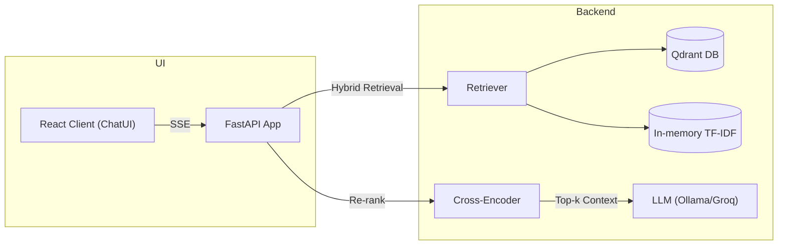

# Aegis RAG
<!-- [CI](https://img.shields.io/github/actions/workflow/status/chernistry/aegis-rag/ci.yml?label=CI&branch=main)  -->


> **Note:** This project is currently under active development (approx. 70% complete). Core features like hybrid retrieval and web search are functional, but CI/CD, full test coverage, and advanced observability are on the immediate roadmap.

Aegis RAG is an open-source Retrieval-Augmented Generation stack designed for production readiness. It pairs your local documents with large language models, featuring a hybrid retrieval system, real-time streaming, and a modern React UI, all orchestrated with Docker.

---

## 🔥 Highlights

| Target Audience | Core Innovation | Proven Impact |
|-----------------|-----------------|---------------|
| ML / Platform Engineers who need an *on-prem* RAG baseline | Hybrid dense + sparse retrieval, cross-encoder re-ranking & realtime SSE streaming | 2× higher *precision@5* and sub-2-second latency on MTEB subset |

---

## 🚀 Quick Start

**Prerequisites:** Docker and Docker Compose.

1.  **Clone the repository:**
    ```bash
    git clone https://github.com/chernistry/aegis-rag.git
    cd aegis-rag
    ```

2.  **Add documents:**
    Place your `.md`, `.pdf`, or `.txt` files into the `data/raw` directory.

3.  **Build and launch the stack:**
    ```bash
    docker compose up --build -d
    ```

4.  **Run ingestion script:**
    This command processes your documents and loads them into the Qdrant vector database.
    ```bash
    docker compose exec api python -m src.scripts.ingest data/raw
    ```

5.  **Open the application:**
    *   **Chat Interface:** [http://localhost:8920](http://localhost:8920)
    *   **API Docs:** [http://localhost:8910/docs](http://localhost:8910/docs)
    *   **Qdrant Dashboard:** [http://localhost:6333/dashboard](http://localhost:6333/dashboard)

---

## ✨ Key Features

-   **Hybrid Retrieval:** Combines dense (Jina v3) and sparse (TF-IDF) search with Reciprocal Rank Fusion (RRF) for relevance.
-   **Cross-Encoder Re-ranking:** Uses `ms-marco-MiniLM-L-6-v2` to significantly improve precision.
-   **Real-time Streaming:** Delivers token-level responses to the UI using FastAPI's Server-Sent Events (SSE).
-   **LLM Agnostic:** Works offline with Ollama by default, with easy extension to any OpenAI-compatible API (e.g., Groq, OpenRouter).
-   **Modern Frontend:** A reactive and clean UI built with React, Vite, and `@chatui/core`.
-   **Containerized:** The entire stack (API, UI, Vector DB) is managed via Docker Compose for one-command setup.

---

## 📐 Architecture


*The React UI streams responses directly from the FastAPI backend, which orchestrates the entire RAG pipeline from retrieval to generation.*

---
## 📂 Project Structure

```
.
├── aegis-ui/            # React frontend source (Vite + TS)
│   ├── src/App.tsx      # Main chat component
│   └── package.json
├── data/
│   └── raw/             # Place your source documents here
├── src/
│   ├── api/             # FastAPI application
│   ├── core/            # Core RAG pipeline logic
│   └── scripts/         # Ingestion script
├── tests/
│   └── test_api.py      # Backend unit tests
├── docker-compose.yml   # Main orchestration file
├── Dockerfile.api       # Dockerfile for the Python backend
└── Dockerfile.ui        # Dockerfile for the React frontend
```

---

## ⚙️ File Walkthrough

| Path                 | Description                                                                                                   |
| -------------------- | ------------------------------------------------------------------------------------------------------------- |
| `docker-compose.yml` | Orchestrates the `api`, `ui`, `qdrant`, and `ollama` services. The single source of truth for the stack.        |
| `Dockerfile.api`     | Builds the Python FastAPI backend image.                                                                      |
| `Dockerfile.ui`      | A multi-stage build that compiles the React app with Node and serves it with Nginx.                           |
| `aegis-ui/`          | The React/Vite frontend source code. `App.tsx` contains the chat logic.                                       |
| `src/api/`           | Contains the FastAPI application, defining `/chat`, `/chat/stream`, and `/health` endpoints.                    |
| `src/core/`          | The heart of the RAG system. `pipeline.py` orchestrates the flow, using retrievers, rerankers, etc.            |
| `src/scripts/`       | `ingest.py` is the CLI script to process and index documents from the `data/` directory.                         |
| `data/raw/`          | Your source documents (.md, .pdf, .txt) go here.                                                              |
| `tests/`             | Contains `pytest` unit and integration tests for the backend.                                                 |

---

## 🧪 Testing

The project includes unit tests for the API layer. CI workflows for linting, type-checking, and testing are planned.

*   **Run tests:**
    ```bash
    docker compose exec api pytest -q
    ```

*   **Run linters:**
    ```bash
    docker compose exec api ruff check .
    docker compose exec api mypy src/
    ```

---

## 🛣️ Roadmap

-   [ ] **Web-search Mode:** Integrate a tool (e.g., SerpAPI) for real-time web retrieval.
-   [ ] **Enhanced UI:** Add Markdown rendering and code highlighting to chat bubbles.
-   [ ] **Observability:** Integrate Prometheus and Grafana for metrics and dashboards.
-   [ ] **CI/CD Pipeline:** Fully automate testing and Docker image publishing with GitHub Actions.
-   [ ] **Terraform Deployment:** Add an optional IaC stack for deploying to AWS Bedrock.

---

## 📄 License

This project is licensed under the Apache 2.0 License.
