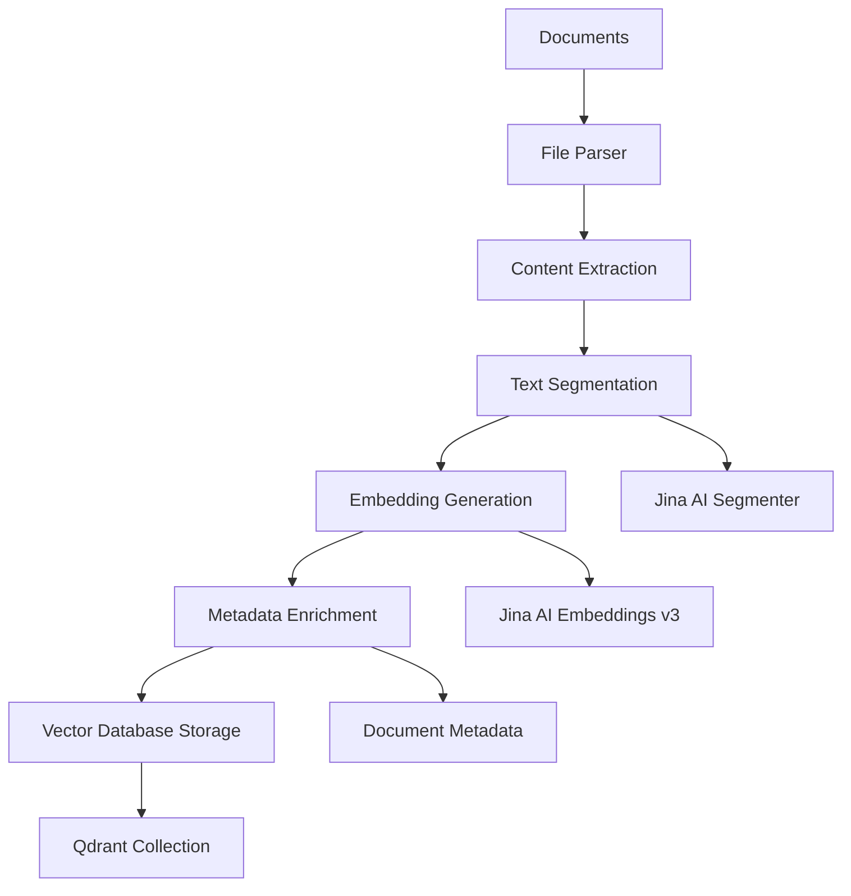
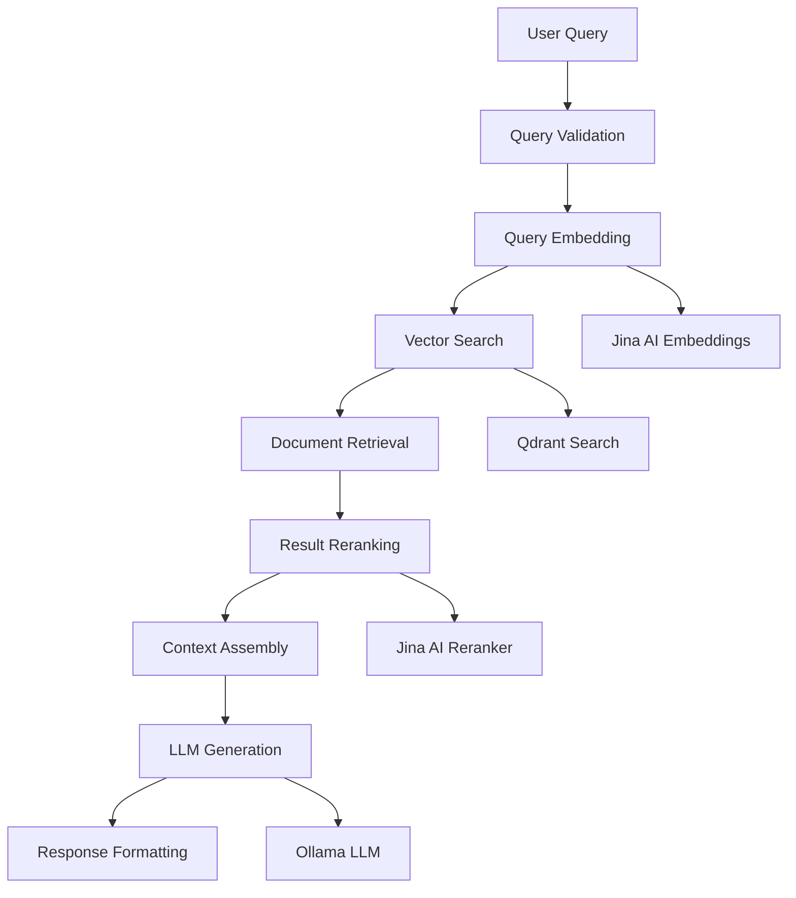

# System Architecture

## Executive Summary

Aegis is a distributed Retrieval-Augmented Generation (RAG) system designed for enterprise-scale document processing and intelligent query response. The architecture emphasizes scalability, reliability, and maintainability through microservices decomposition, event-driven processing, and modern cloud-native patterns.

## Architectural Principles

### Design Philosophy
- **Separation of Concerns**: Clear boundaries between data ingestion, retrieval, and generation
- **Scalability**: Horizontal scaling capabilities for all critical components
- **Fault Tolerance**: Graceful degradation and error recovery mechanisms
- **Observability**: Comprehensive monitoring, logging, and tracing
- **Security**: Defense-in-depth security model with encryption and access controls

### Technical Principles
- **API-First Design**: REST-based interfaces with OpenAPI specifications
- **Stateless Services**: Horizontally scalable stateless components
- **Data Consistency**: Eventually consistent model with conflict resolution
- **Performance Optimization**: Sub-second response times for user queries
- **Resource Efficiency**: Optimal utilization of compute and storage resources

## System Overview

### High-Level Architecture

```
┌─────────────────────────────────────────────────────────────────┐
│                           Client Layer                          │
├─────────────────┬─────────────────┬─────────────────────────────┤
│   Web Apps      │   Mobile Apps   │      API Clients            │
└─────────────────┴─────────────────┴─────────────────────────────┘
                                │
┌─────────────────────────────────────────────────────────────────┐
│                        API Gateway                              │
│              (Authentication, Rate Limiting, CORS)             │
└─────────────────────────────┬───────────────────────────────────┘
                              │
┌─────────────────────────────────────────────────────────────────┐
│                      Aegis Core Platform                       │
├─────────────────┬─────────────────┬─────────────────────────────┤
│  Ingestion      │   Query         │     Management              │
│  Service        │   Service       │     Service                 │
└─────────────────┴─────────────────┴─────────────────────────────┘
                              │
┌─────────────────────────────────────────────────────────────────┐
│                      External Services                         │
├─────────────────┬─────────────────┬─────────────────────────────┤
│   Jina AI       │   Vector DB     │      LLM Service            │
│  (Embed/Rank)   │   (Qdrant)      │     (Ollama)                │
└─────────────────┴─────────────────┴─────────────────────────────┘
```

## Core Components

### 1. API Gateway Layer

**Purpose**: Entry point for all external requests with cross-cutting concerns.

**Responsibilities**:
- Request routing and load balancing
- Authentication and authorization
- Rate limiting and throttling
- Request/response transformation
- CORS policy enforcement
- SSL termination

**Technology Stack**:
- **Framework**: FastAPI with Uvicorn ASGI server
- **Middleware**: Custom middleware for CORS, authentication
- **Monitoring**: Prometheus metrics integration

### 2. Document Ingestion Service

**Purpose**: Process and index documents into the vector database.

**Architecture**:
```
┌─────────────┐    ┌─────────────┐    ┌─────────────┐    ┌─────────────┐
│   Document  │ -> │   Parser    │ -> │  Segmenter  │ -> │  Embedding  │
│   Loader    │    │   Engine    │    │   Service   │    │   Generator │
└─────────────┘    └─────────────┘    └─────────────┘    └─────────────┘
                                                                   │
┌─────────────┐    ┌─────────────┐    ┌─────────────┐              │
│   Vector    │ <- │   Batch     │ <- │  Metadata   │ <------------┘
│  Database   │    │  Processor  │    │  Enrichment │
└─────────────┘    └─────────────┘    └─────────────┘
```

**Processing Pipeline**:
1. **Document Loading**: Multi-format support (PDF, Markdown, TXT)
2. **Content Extraction**: Text extraction with structure preservation
3. **Segmentation**: Intelligent chunking via Jina AI Segmenter
4. **Embedding Generation**: Vector embedding via Jina AI Embeddings v3
5. **Metadata Enrichment**: Document metadata and indexing information
6. **Vector Storage**: Batch insertion into Qdrant vector database

**Key Features**:
- **Concurrent Processing**: Parallel document processing
- **Error Recovery**: Retry mechanisms with exponential backoff
- **Progress Tracking**: Ingestion status and completion metrics
- **Quality Assurance**: Content validation and filtering

### 3. Query Processing Service

**Purpose**: Handle user queries through retrieval and generation pipeline.

**Query Flow**:
```
┌─────────────┐    ┌─────────────┐    ┌─────────────┐    ┌─────────────┐
│    User     │ -> │   Query     │ -> │  Embedding  │ -> │   Vector    │
│   Query     │    │ Validation  │    │  Generation │    │   Search    │
└─────────────┘    └─────────────┘    └─────────────┘    └─────────────┘
                                                                   │
┌─────────────┐    ┌─────────────┐    ┌─────────────┐              │
│   Response  │ <- │     LLM     │ <- │  Document   │ <------------┘
│  Generation │    │ Generation  │    │  Reranking  │
└─────────────┘    └─────────────┘    └─────────────┘
```

**Processing Stages**:
1. **Query Validation**: Input sanitization and validation
2. **Embedding Generation**: Query vectorization using Jina AI
3. **Similarity Search**: K-nearest neighbor search in Qdrant
4. **Document Reranking**: Relevance reranking via Jina AI Reranker
5. **Context Assembly**: Document context preparation
6. **Answer Generation**: LLM-based response generation via Ollama
7. **Response Formatting**: Structured response with sources

### 4. Vector Database (Qdrant)

**Purpose**: High-performance vector storage and similarity search.

**Configuration**:
- **Vector Dimensions**: 1024 (Jina Embeddings v3)
- **Distance Metric**: Cosine similarity
- **Index Type**: HNSW (Hierarchical Navigable Small World)
- **Quantization**: Scalar quantization for memory efficiency

**Performance Characteristics**:
- **Search Latency**: Sub-100ms for typical queries
- **Throughput**: 1000+ queries per second
- **Storage**: Optimized for large-scale document collections
- **Memory Usage**: Configurable memory-disk trade-offs

### 5. Language Model Service (Ollama)

**Purpose**: Generate contextual responses using large language models.

**Model Configuration**:
- **Primary Model**: DeepSeek-R1 7B
- **Alternative Models**: Configurable model switching
- **Context Window**: 8K tokens maximum
- **Generation Parameters**: Temperature, top-p, max tokens

**Resource Management**:
- **GPU Utilization**: CUDA acceleration when available
- **Memory Management**: Model loading and offloading
- **Concurrent Requests**: Request queuing and batching

## Data Flow Architecture

### Document Ingestion Flow



### Query Processing Flow



## Scalability Design

### Horizontal Scaling Strategy

**API Layer**:
- Load balancer distribution across multiple API instances
- Stateless design enables seamless scaling
- Connection pooling for external service efficiency

**Vector Database**:
- Qdrant cluster configuration for high availability
- Read replicas for query load distribution
- Sharding strategy for large document collections

**LLM Service**:
- Multiple Ollama instances for concurrent request handling
- Model deployment across GPU-enabled nodes
- Request queuing and load balancing

### Performance Optimization

**Caching Strategy**:
- **Query Results**: Redis cache for frequent queries
- **Embeddings**: In-memory embedding cache
- **Model Responses**: Configurable response caching

**Connection Management**:
- **Database Connections**: Connection pooling with health checks
- **HTTP Clients**: Persistent connections with keep-alive
- **Circuit Breakers**: Fault tolerance for external services

## Security Architecture

### Data Protection
- **Encryption at Rest**: AES-256 encryption for stored documents
- **Encryption in Transit**: TLS 1.3 for all communications
- **Access Controls**: Role-based access control (RBAC)
- **API Security**: Rate limiting and request validation

### Network Security
- **Network Segmentation**: Isolated service networks
- **Firewall Rules**: Restrictive ingress/egress policies
- **Service Mesh**: mTLS between internal services
- **VPN Integration**: Secure remote access requirements

### Compliance
- **Data Governance**: Document lineage and audit trails
- **Privacy Controls**: PII detection and masking
- **Retention Policies**: Automated data lifecycle management
- **Regulatory Compliance**: GDPR, SOC 2, ISO 27001 considerations

## Monitoring and Observability

### Metrics Collection
- **Application Metrics**: Response times, error rates, throughput
- **Infrastructure Metrics**: CPU, memory, disk, network utilization
- **Business Metrics**: Query accuracy, user satisfaction scores
- **External Service Metrics**: API latency and availability

### Logging Strategy
- **Structured Logging**: JSON format with correlation IDs
- **Log Aggregation**: Centralized log collection and analysis
- **Alert Definitions**: Threshold-based alerting for critical metrics
- **Distributed Tracing**: Request flow across service boundaries

### Health Monitoring
- **Health Checks**: Deep health validation for all components
- **Service Discovery**: Dynamic service registration and health tracking
- **Dependency Monitoring**: External service availability tracking
- **Performance Baselines**: SLA monitoring and reporting

## Disaster Recovery

### Backup Strategy
- **Vector Database**: Point-in-time snapshots with geographic distribution
- **Configuration**: Infrastructure as code with version control
- **Application State**: Stateless design minimizes recovery complexity
- **Document Sources**: Source document backup and versioning

### Recovery Procedures
- **RTO (Recovery Time Objective)**: 4 hours for full service restoration
- **RPO (Recovery Point Objective)**: 1 hour maximum data loss
- **Failover Process**: Automated failover for critical components
- **Testing Schedule**: Quarterly disaster recovery testing

## Technology Stack Summary

| Component | Technology | Version | Purpose |
|-----------|------------|---------|---------|
| API Framework | FastAPI | 0.111.0 | REST API development |
| ASGI Server | Uvicorn | 0.29.0 | High-performance HTTP server |
| Vector Database | Qdrant | Latest | Vector storage and search |
| LLM Runtime | Ollama | Latest | Language model serving |
| Embedding Service | Jina AI v3 | API | Text embedding generation |
| Reranking Service | Jina AI v2 | API | Result reranking |
| Container Runtime | Docker | Latest | Application containerization |
| Orchestration | Docker Compose | Latest | Multi-service deployment |
| HTTP Client | httpx | 0.27.0 | Async HTTP communications |
| Data Processing | NumPy/Pandas | Latest | Document processing |

## Future Architecture Considerations

### Planned Enhancements
- **Kubernetes Migration**: Container orchestration for production scale
- **Event-Driven Architecture**: Asynchronous processing with message queues
- **Multi-Modal Support**: Image, audio, and video content processing
- **Federated Search**: Multi-source knowledge base integration
- **Real-Time Updates**: Incremental document updates and streaming

### Technical Debt Management
- **Code Quality**: Automated code quality gates and technical debt tracking
- **Performance Optimization**: Continuous performance profiling and optimization
- **Security Updates**: Regular security vulnerability assessments
- **Dependency Management**: Automated dependency updates and testing