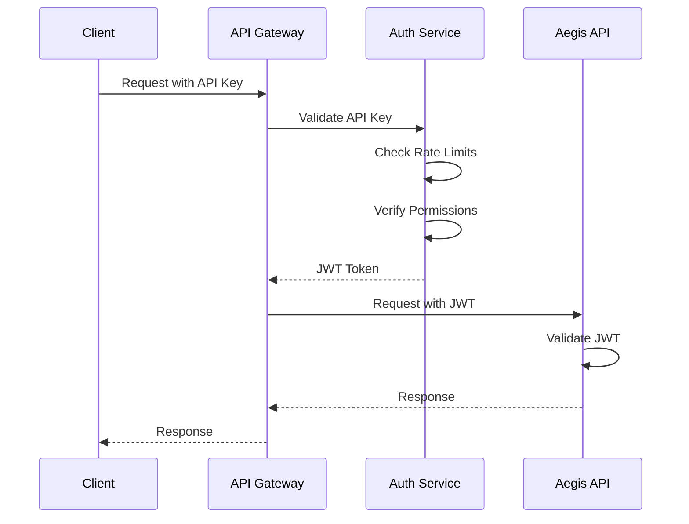
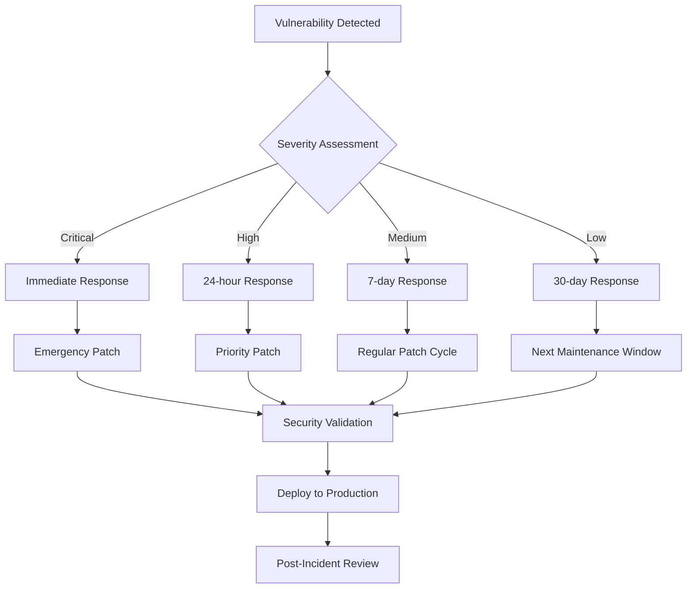

# Security Guide

## Overview

This document outlines the security architecture, best practices, and compliance considerations for the Aegis RAG system. The security model follows defense-in-depth principles with multiple layers of protection across network, application, data, and infrastructure components.

## Security Architecture

### Defense-in-Depth Model

```
┌─────────────────────────────────────────────────────────────────┐
│                       Network Security Layer                    │
│  ┌─────────────────┐  ┌─────────────────┐  ┌─────────────────┐ │
│  │   Firewall      │  │   Load Balancer │  │   VPN Gateway   │ │
│  │   Rules         │  │   with WAF      │  │   (Optional)    │ │
│  └─────────────────┘  └─────────────────┘  └─────────────────┘ │
└─────────────────────────────────────────────────────────────────┘
                                 │
┌─────────────────────────────────────────────────────────────────┐
│                    Application Security Layer                   │
│  ┌─────────────────┐  ┌─────────────────┐  ┌─────────────────┐ │
│  │ API Gateway     │  │ Authentication  │  │ Authorization   │ │
│  │ Rate Limiting   │  │ & JWT Tokens    │  │ & RBAC          │ │
│  └─────────────────┘  └─────────────────┘  └─────────────────┘ │
└─────────────────────────────────────────────────────────────────┘
                                 │
┌─────────────────────────────────────────────────────────────────┐
│                      Data Security Layer                        │
│  ┌─────────────────┐  ┌─────────────────┐  ┌─────────────────┐ │
│  │ Encryption      │  │ Data            │  │ Secure          │ │
│  │ at Rest/Transit │  │ Classification  │  │ Communications  │ │
│  └─────────────────┘  └─────────────────┘  └─────────────────┘ │
└─────────────────────────────────────────────────────────────────┘
                                 │
┌─────────────────────────────────────────────────────────────────┐
│                  Infrastructure Security Layer                  │
│  ┌─────────────────┐  ┌─────────────────┐  ┌─────────────────┐ │
│  │ Container       │  │ Secrets         │  │ Monitoring      │ │
│  │ Security        │  │ Management      │  │ & Alerting      │ │
│  └─────────────────┘  └─────────────────┘  └─────────────────┘ │
└─────────────────────────────────────────────────────────────────┘
```

## Network Security

### Firewall Configuration

#### Ingress Rules

| Port | Protocol | Source | Purpose | Security Level |
|------|----------|--------|---------|---------------|
| 443 | HTTPS | Internet | API Access | High |
| 80 | HTTP | Internet | Redirect to HTTPS | Medium |
| 8910 | HTTP | Internal | Direct API (Development) | Low |
| 6333 | TCP | Internal | Qdrant Database | High |
| 11434 | TCP | Internal | Ollama Service | High |

#### Egress Rules

| Destination | Port | Purpose | Restrictions |
|------------|------|---------|-------------|
| api.jina.ai | 443 | Embedding/Reranking APIs | Rate limited |
| Internal Services | Various | Service Communication | Authenticated |
| Package Repositories | 443 | Software Updates | Scheduled windows |
| Monitoring Services | 443 | Metrics and Logs | Encrypted channels |

### Network Segmentation

#### Production Network Topology

```
Internet
    │
    ▼
┌─────────────────┐
│  Load Balancer  │ (DMZ)
│     Layer       │
└─────────────────┘
    │
    ▼
┌─────────────────┐
│  Application    │ (Application Tier)
│     Layer       │ VLAN: 10.0.1.0/24
└─────────────────┘
    │
    ▼
┌─────────────────┐
│   Data Layer    │ (Data Tier)
│                 │ VLAN: 10.0.2.0/24
└─────────────────┘
    │
    ▼
┌─────────────────┐
│  Management     │ (Management Network)
│    Network      │ VLAN: 10.0.3.0/24
└─────────────────┘
```

### TLS Configuration

#### Certificate Management

```yaml
# TLS Configuration
tls:
  version: "1.3"
  cipher_suites:
    - "TLS_AES_256_GCM_SHA384"
    - "TLS_CHACHA20_POLY1305_SHA256"
    - "TLS_AES_128_GCM_SHA256"
  
certificate_rotation:
  automatic: true
  validity_period: "90 days"
  renewal_threshold: "30 days"
  
hsts:
  enabled: true
  max_age: "31536000"
  include_subdomains: true
  preload: true
```

## Application Security

### Authentication and Authorization

#### API Security Model

```python
# JWT Token Configuration
JWT_CONFIG = {
    "algorithm": "RS256",
    "token_expiration": 3600,  # 1 hour
    "refresh_token_expiration": 86400,  # 24 hours
    "issuer": "aegis-rag-system",
    "audience": "aegis-api-clients"
}

# Role-Based Access Control
RBAC_PERMISSIONS = {
    "admin": ["read", "write", "manage", "monitor"],
    "operator": ["read", "write", "monitor"],
    "viewer": ["read", "monitor"],
    "service": ["read", "write"]
}
```

#### Authentication Flow



### Input Validation and Sanitization

#### Request Validation

```python
# Input Validation Schema
REQUEST_VALIDATION = {
    "question": {
        "type": "string",
        "min_length": 1,
        "max_length": 1000,
        "pattern": r"^[a-zA-Z0-9\s\-\.\,\?\!\(\)]+$",
        "sanitization": "strict"
    },
    "history": {
        "type": "array",
        "max_items": 10,
        "items": {
            "type": "object",
            "required": ["role", "content"],
            "properties": {
                "role": {"enum": ["user", "assistant"]},
                "content": {"type": "string", "max_length": 2000}
            }
        }
    }
}
```

#### Content Security Policy

```nginx
# CSP Headers
add_header Content-Security-Policy "
    default-src 'self';
    script-src 'self' 'unsafe-inline';
    style-src 'self' 'unsafe-inline';
    img-src 'self' data: https:;
    font-src 'self';
    connect-src 'self' https://api.jina.ai;
    frame-ancestors 'none';
    base-uri 'self';
    form-action 'self';
" always;

add_header X-Frame-Options "DENY" always;
add_header X-Content-Type-Options "nosniff" always;
add_header X-XSS-Protection "1; mode=block" always;
add_header Referrer-Policy "strict-origin-when-cross-origin" always;
```

### Rate Limiting and DDoS Protection

#### Rate Limiting Configuration

```yaml
rate_limiting:
  global:
    requests_per_second: 100
    burst_size: 200
    
  per_endpoint:
    "/chat":
      requests_per_minute: 20
      burst_size: 5
    "/health":
      requests_per_second: 10
      burst_size: 20
      
  per_client:
    requests_per_hour: 1000
    concurrent_requests: 5
    
blocking:
  suspicious_patterns:
    - sql_injection_attempts
    - xss_attempts
    - path_traversal_attempts
  
  geographic_restrictions:
    enabled: false  # Configure as needed
    allowed_countries: []
```

## Data Security

### Data Classification

#### Classification Levels

| Level | Description | Examples | Security Controls |
|-------|-------------|----------|-------------------|
| Public | Information intended for public consumption | Marketing materials | Standard encryption |
| Internal | Information for internal use only | Process documentation | Access controls + encryption |
| Confidential | Sensitive business information | Customer data, analytics | Strong encryption + audit logging |
| Restricted | Highly sensitive information | Security keys, PII | Maximum security controls |

#### Data Handling Matrix

| Data Type | Classification | Encryption at Rest | Encryption in Transit | Audit Logging | Retention Period |
|-----------|---------------|-------------------|---------------------|---------------|------------------|
| User Queries | Internal | AES-256 | TLS 1.3 | Yes | 90 days |
| Document Content | Confidential | AES-256 | TLS 1.3 | Yes | Per policy |
| System Logs | Internal | AES-256 | TLS 1.3 | Yes | 1 year |
| API Keys | Restricted | AES-256 + HSM | TLS 1.3 | Yes | N/A |
| Embeddings | Internal | AES-256 | TLS 1.3 | Yes | Per document |

### Encryption

#### Encryption at Rest

```yaml
# Database Encryption
qdrant:
  encryption:
    enabled: true
    algorithm: "AES-256-GCM"
    key_rotation: "quarterly"
    backup_encryption: true

# File System Encryption
storage:
  encryption:
    type: "LUKS"
    cipher: "aes-xts-plain64"
    key_size: 256
    hash: "sha256"
```

#### Encryption in Transit

```yaml
# Service-to-Service Communication
internal_tls:
  enabled: true
  mutual_auth: true
  certificate_authority: "internal-ca"
  cipher_suites:
    - "ECDHE-ECDSA-AES256-GCM-SHA384"
    - "ECDHE-RSA-AES256-GCM-SHA384"

# External API Communication
external_apis:
  jina_ai:
    tls_version: "1.3"
    certificate_pinning: true
    timeout: 30
```

### Data Privacy and Compliance

#### GDPR Compliance

```python
# Data Subject Rights Implementation
class DataSubjectRights:
    """
    Implementation of GDPR data subject rights for the Aegis RAG system.
    """
    
    def right_to_access(self, user_id: str) -> Dict[str, Any]:
        """Provide user with access to their personal data."""
        pass
    
    def right_to_rectification(self, user_id: str, corrections: Dict) -> bool:
        """Allow users to correct inaccurate personal data."""
        pass
    
    def right_to_erasure(self, user_id: str) -> bool:
        """Delete user's personal data (right to be forgotten)."""
        pass
    
    def right_to_data_portability(self, user_id: str) -> bytes:
        """Export user's data in machine-readable format."""
        pass
    
    def right_to_restrict_processing(self, user_id: str) -> bool:
        """Limit processing of user's personal data."""
        pass
```

## Infrastructure Security

### Container Security

#### Container Image Security

```dockerfile
# Security-hardened Dockerfile
FROM python:3.11-slim as base

# Create non-root user
RUN groupadd --gid 1001 aegis && \
    useradd --uid 1001 --gid aegis --shell /bin/bash aegis

# Install security updates
RUN apt-get update && \
    apt-get upgrade -y && \
    apt-get install -y --no-install-recommends \
        ca-certificates \
        && rm -rf /var/lib/apt/lists/*

# Set security-focused environment variables
ENV PYTHONDONTWRITEBYTECODE=1 \
    PYTHONUNBUFFERED=1 \
    PYTHONIOENCODING=utf-8 \
    PIP_NO_CACHE_DIR=1 \
    PIP_DISABLE_PIP_VERSION_CHECK=1

# Copy application with proper ownership
COPY --chown=aegis:aegis . /app
WORKDIR /app

# Switch to non-root user
USER aegis

# Security scanner configuration
LABEL security.scan="enabled" \
      security.policy="strict" \
      maintainer="security@company.com"
```

#### Kubernetes Security Policies

```yaml
# Pod Security Policy
apiVersion: policy/v1beta1
kind: PodSecurityPolicy
metadata:
  name: aegis-psp
spec:
  privileged: false
  allowPrivilegeEscalation: false
  requiredDropCapabilities:
    - ALL
  volumes:
    - 'configMap'
    - 'emptyDir'
    - 'projected'
    - 'secret'
    - 'downwardAPI'
    - 'persistentVolumeClaim'
  runAsUser:
    rule: 'MustRunAsNonRoot'
  runAsGroup:
    rule: 'MustRunAs'
    ranges:
      - min: 1001
        max: 65535
  seLinux:
    rule: 'RunAsAny'
  fsGroup:
    rule: 'RunAsAny'
```

### Secrets Management

#### Kubernetes Secrets

```yaml
# External Secrets Operator Configuration
apiVersion: external-secrets.io/v1beta1
kind: SecretStore
metadata:
  name: aegis-secret-store
spec:
  provider:
    vault:
      server: "https://vault.internal.company.com"
      path: "secret"
      version: "v2"
      auth:
        kubernetes:
          mountPath: "kubernetes"
          role: "aegis-rag"
---
apiVersion: external-secrets.io/v1beta1
kind: ExternalSecret
metadata:
  name: aegis-secrets
spec:
  refreshInterval: 1h
  secretStoreRef:
    name: aegis-secret-store
    kind: SecretStore
  target:
    name: aegis-secrets
    creationPolicy: Owner
  data:
  - secretKey: jina-api-key
    remoteRef:
      key: aegis/jina
      property: api_key
```

#### Secret Rotation

```bash
#!/bin/bash
# secret_rotation.sh - Automated secret rotation

VAULT_ADDR="https://vault.internal.company.com"
SECRET_PATH="aegis/jina"

rotate_jina_api_key() {
    echo "Rotating Jina AI API key..."
    
    # Generate new API key (implementation depends on provider)
    NEW_KEY=$(generate_new_jina_key)
    
    # Test new key
    if test_jina_key "$NEW_KEY"; then
        # Store in vault
        vault kv put "$SECRET_PATH" api_key="$NEW_KEY"
        
        # Update Kubernetes secret
        kubectl patch secret aegis-secrets \
            -p "{\"data\":{\"jina-api-key\":\"$(echo -n "$NEW_KEY" | base64)\"}}"
        
        # Rolling restart of services
        kubectl rollout restart deployment/aegis-api
        
        echo "API key rotation completed successfully"
    else
        echo "New API key validation failed"
        exit 1
    fi
}

# Schedule for monthly rotation
if [[ "$(date +%d)" == "01" ]]; then
    rotate_jina_api_key
fi
```

## Security Monitoring and Incident Response

### Security Event Logging

#### Log Categories

```yaml
security_logging:
  authentication:
    - login_attempts
    - failed_authentication
    - token_generation
    - token_validation
    
  authorization:
    - permission_checks
    - access_denials
    - privilege_escalation_attempts
    
  data_access:
    - document_queries
    - sensitive_data_access
    - bulk_operations
    
  system_events:
    - configuration_changes
    - service_starts_stops
    - error_conditions
    
  network_security:
    - connection_attempts
    - rate_limit_violations
    - suspicious_traffic_patterns
```

#### SIEM Integration

```python
# Security Information and Event Management
class SecurityEventLogger:
    """
    Centralized security event logging for SIEM integration.
    """
    
    def __init__(self, siem_endpoint: str, api_key: str):
        self.siem_endpoint = siem_endpoint
        self.api_key = api_key
    
    def log_security_event(
        self,
        event_type: str,
        severity: str,
        user_id: Optional[str] = None,
        ip_address: Optional[str] = None,
        details: Optional[Dict] = None
    ) -> None:
        """
        Log security events to SIEM system.
        
        Args:
            event_type: Type of security event
            severity: Event severity (low, medium, high, critical)
            user_id: Associated user identifier
            ip_address: Source IP address
            details: Additional event details
        """
        event = {
            "timestamp": datetime.utcnow().isoformat(),
            "event_type": event_type,
            "severity": severity,
            "source": "aegis-rag",
            "user_id": user_id,
            "ip_address": ip_address,
            "details": details or {}
        }
        
        # Send to SIEM
        self._send_to_siem(event)
        
        # Local logging for backup
        logger.info(f"Security event: {event}")
```

### Vulnerability Management

#### Security Scanning Pipeline

```yaml
# Security scanning in CI/CD
security_scans:
  static_analysis:
    tools:
      - bandit      # Python security linter
      - safety      # Dependency vulnerability check
      - semgrep     # Code pattern analysis
    
  dependency_scanning:
    tools:
      - snyk        # Dependency vulnerability scanning
      - trivy       # Container image scanning
      - grype       # Binary vulnerability scanning
    
  dynamic_analysis:
    tools:
      - zap         # Web application security testing
      - nikto       # Web server scanner
    
  infrastructure:
    tools:
      - checkov     # Infrastructure as code scanning
      - kube-score  # Kubernetes configuration analysis
```

#### Vulnerability Response Process



## Compliance and Governance

### Regulatory Compliance

#### SOC 2 Type II Controls

| Control | Description | Implementation | Monitoring |
|---------|-------------|----------------|------------|
| CC6.1 | Logical Access Controls | RBAC, MFA | Access logs, reviews |
| CC6.2 | System Access Monitoring | SIEM, alerting | Real-time monitoring |
| CC6.3 | Access Revocation | Automated process | Weekly audit |
| CC7.1 | Data Security | Encryption, DLP | Continuous scanning |
| CC7.2 | Data Integrity | Checksums, versioning | Automated validation |

#### ISO 27001 Compliance

```yaml
iso27001_controls:
  A.9.1.1:  # Access control policy
    implementation: "RBAC with documented procedures"
    review_frequency: "annual"
    
  A.9.2.3:  # Management of privileged access rights
    implementation: "Just-in-time access with approval workflow"
    review_frequency: "quarterly"
    
  A.10.1.1: # Cryptographic controls policy
    implementation: "AES-256 encryption for data at rest and in transit"
    review_frequency: "annual"
    
  A.12.1.2: # Change management
    implementation: "GitOps workflow with security reviews"
    review_frequency: "continuous"
```

### Security Governance

#### Security Policies

1. **Information Security Policy**
   - Data classification and handling procedures
   - Access control requirements
   - Incident response procedures

2. **Risk Management Policy**
   - Risk assessment methodology
   - Risk tolerance levels
   - Mitigation strategies

3. **Business Continuity Policy**
   - Disaster recovery procedures
   - Business impact analysis
   - Recovery time objectives

#### Security Training Requirements

| Role | Training Requirements | Frequency |
|------|----------------------|-----------|
| All Staff | Security awareness, phishing simulation | Annual |
| Developers | Secure coding practices, OWASP Top 10 | Bi-annual |
| Operations | Incident response, forensics | Quarterly |
| Management | Risk management, compliance | Annual |

## Security Checklist

### Pre-Deployment Security Checklist

- [ ] Security assessment completed
- [ ] Vulnerability scanning passed
- [ ] Penetration testing completed
- [ ] Security configurations reviewed
- [ ] Access controls validated
- [ ] Encryption verified
- [ ] Monitoring configured
- [ ] Incident response plan tested
- [ ] Compliance requirements met
- [ ] Security documentation updated

### Ongoing Security Operations

#### Daily Tasks
- [ ] Review security alerts
- [ ] Monitor authentication logs
- [ ] Check system health
- [ ] Validate backup integrity

#### Weekly Tasks
- [ ] Security scan results review
- [ ] Access rights audit
- [ ] Incident response drill
- [ ] Policy compliance check

#### Monthly Tasks
- [ ] Vulnerability assessment
- [ ] Security metrics review
- [ ] Training completion tracking
- [ ] Risk assessment update

#### Quarterly Tasks
- [ ] Penetration testing
- [ ] Business continuity testing
- [ ] Security awareness assessment
- [ ] Compliance audit preparation

---

*This security guide provides a comprehensive framework for securing the Aegis RAG system. Regular reviews and updates ensure continued protection against evolving threats and compliance with regulatory requirements.*