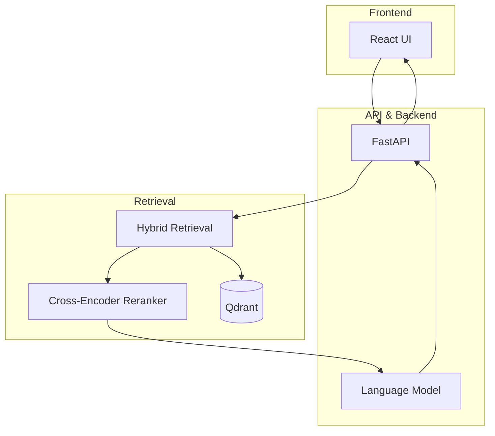

# Aegis RAG - Modern Retrieval-Augmented Generation System

Aegis RAG is a production-ready retrieval-augmented generation system built on modern RAG architecture principles.

## Features

- **Hybrid Search**: Combines dense (vector) and sparse retrieval for improved search quality
- **Reranking**: Uses cross-encoder models to refine search results
- **Web Search**: Dynamically fetches information from the internet to enrich context
- **Streaming Generation**: SSE-based response streaming for interactive user experience
- **Modern Architecture**: Docker containers, FastAPI, Qdrant vector database
- **Monitoring**: Prometheus and Grafana for performance tracking

## Quick Start

### Запуск с Docker Compose

```bash
# Clone the repository
git clone https://github.com/yourusername/aegis-rag.git
cd aegis-rag

# Create .env file with necessary variables
cp .env.example .env
# Edit .env, adding API keys and settings

# Start containers
docker compose up -d
```

### Индексация документов

```bash
# Activate conda environment, if using
conda activate rag

# Run indexing script
python ingest_simple.py
```

### Поиск документов

```bash
python search_docs.py "Your search query"
```

## Архитектура



## Доступные сервисы

- **UI**: http://localhost:8920
- **API**: http://localhost:8910
- **Qdrant**: http://localhost:6333/dashboard
- **Ollama**: http://localhost:11434

## Документация API

Swagger UI доступен по адресу: http://localhost:8910/docs

## Использованные библиотеки

- **FastAPI**: Асинхронный API-фреймворк с автоматической документацией
- **Qdrant**: Высокопроизводительная векторная база данных
- **Sentence Transformers**: Модели для генерации эмбеддингов
- **React**: Современный UI на основе Alibaba ChatUI

## Контрибуторы

- Ваше имя и контакты

## Лицензия

MIT
